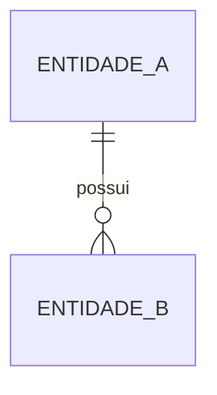
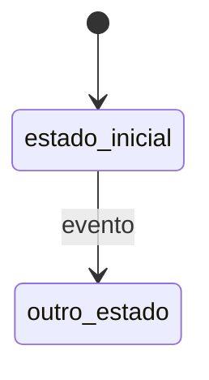

# Modelo de domínio

As entidades do negócio, como se relacionam, quais estados atravessam e quais regras nunca podem ser violadas. É o documento que faz o agente entender **o negócio**, não só o código. Independe de como os dados são armazenados.

**Última atualização:** {{AAAA-MM-DD}}

## 1. Mapa de entidades

## 2. Entidades

### {{Entidade}}

**O que é:** {{definição em uma frase, alinhada ao glossário}}
**Identidade:** {{o que a torna única}}

| Atributo | Significado | Regras |
| --- | --- | --- |
| | | |

**Ciclo de vida:**

| Transição | Quem pode | Condição | Efeitos |
| --- | --- | --- | --- |
| | | | |

## 3. Invariantes

Regras que precisam ser verdadeiras **sempre**, em qualquer operação. Todo código que altera estas entidades deve preservá-las, e cada uma deve ter teste.

| ID | Invariante | Onde é garantida |
| --- | --- | --- |
| INV-01 | {{ex.: o saldo nunca é negativo}} | {{camada/módulo}} |

## 4. Operações que atravessam entidades

<!-- Operações que mudam várias entidades e precisam ser atômicas ou ordenadas. -->

| Operação | Entidades afetadas | Garantia necessária |
| --- | --- | --- |
| | | {{atômica / idempotente / ordenada}} |

## 5. Persistência

<!-- Como o modelo é armazenado, se diferir do modelo conceitual. Link para esquema detalhado, se houver. -->
